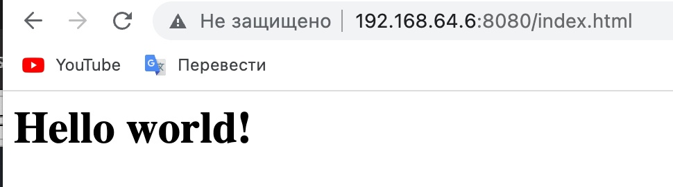

# PHP x APACHE x MySql

В данном репозитории лежит простое веб-приложение, позволяющие делать CRUD операции
Так же лежат конфигурации apache и самого сайта.

Мой GitHub https://github.com/Nik1taZz

Требования: MySql(База данный DateUsers c таблицей Users), PHP, Apache.


# Настройка apache и создание виртуального хоста.  

1)Команды для установки Apache сервера
```bash
sudo apt-get install apache2
```

2)Создание структуры каталогов():
```bash
sudo mkdir -p /var/www/boom.com/public_html
```

3)Назначение прав:
```bash
sudo chown -R $USER:$USER /var/www/boom.com/public_html
```
```bash
sudo chmod -R /var/www/
```

4)Создание демо-страниц:
```bash
nano /var/www/boom.com/public_html/index.html
```
```bash
<html>
  <head>
    <title>Welcome to boom.com!</title>
  </head>
  <body>
    <h1>Hello Word!</h1>
  </body>
</html>
```

5)Создание файла первого физического хоста:
```bash
sudo cp /etc/apache2/sites-available/000-default.conf /etc/apache2/sites-available/boom.com.conf
```
Откройте новый файл
```bash
sudo nano /etc/apache2/sites-available/boom.com.conf
```
Файл будет похож на этот(Если вы хотите поменять порт, то нужно в VirtualHost значение 80 заменить на 8080, как это сделал я, или на любой удобный Вам). 

P.S. Для замены порта еще потребуется изменить один конфиг /etc/apache2/ports.conf(Listen 80 поменять на 8080 или на какой захотите) 
```bash
<VirtualHost *:8080>
    ServerAdmin webmaster@localhost
    DocumentRoot /var/www/html
    ErrorLog ${APACHE_LOG_DIR}/error.log
    CustomLog ${APACHE_LOG_DIR}/access.log combined
</VirtualHost>
```
Bы должны добавить две новые директивы. Первый ServerName, составляющий основной домен, который должен соответствовать названному объекту хоста. Это было ваше доменное имя. Второй ServerAlias, определяет другие имена, которые должны интерпретироваться так, как будто это основной домен. Это удобно для использования дополнительных доменных имен, например, с использованием www:

```bash
ServerName boom.com
ServerAlias www.boom.com
```

6)Включение нового виртуального хоста:
```bash
sudo a2ensite boom.com
```

7)Перезапуск сервера:
```bash
sudo service apache2 restart
``` 
8)Тест результатов:
```bash
http://localhost:8080/index.html
``` 
Вбейте в браузер hhtp://(ваш IP):(порт)/index.html

У вас должно получится так:

