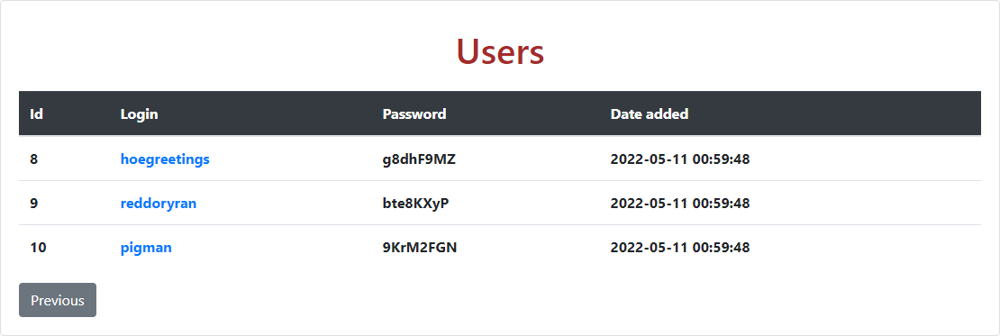

# Задача #3.

С помощью связки **`Nginx`, `PHP`, `PostgreSQL`** разработать приложение, которое будет выводить список пользователей по адресу 127.0.0.1/users.php, а по адресу 127.0.0.1/users/edit.php?id=XXX будет возможность ре> Пояснение: нажимия на кнопки <kbd>Previous</kbd>, <kbd>Next</kbd> переходим  
> между страниц с пользователями. Если страница является начальной, кнопка <kbd>Previous</kbd>  
> не доступна. Eсли страница является последней, кнопка <kbd>Next</kbd> не доступна.дактировать любого пользователя.

## Результат работы.

---

### 1. Таблица пользователей.

> Нажимия на кнопки <kbd>Previous</kbd>, <kbd>Next</kbd> переходим между страниц с пользователями.  
> Если страница является начальной, кнопка <kbd>Previous</kbd> не доступна.  
> Eсли страница является последней, кнопка <kbd>Next</kbd> не доступна.  
> Нажимая на **Login** пользователя, совершается переход на страницу редактирования его данных

### 2. Редактирование пользователя.

> Если какое-либо из полей является пустым при нажатии кнопки <kbd>Save</kbd> то выскакивает сообщение об ошибке.  
> Если все поля заполнены, то, при нажатии <kbd>Save</kbd>, данные изменятся и осуществится переход на таблицу пользователей.

